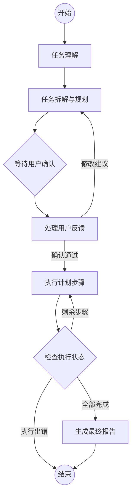

# AutoPlanAgent - 自动化数据分析智能体

AutoPlanAgent 是一个基于 **LangGraph** 构建的高级数据分析智能体系统。它能够深度理解用户的自然语言需求，自动拆解分析任务，并在用户确认后自主执行 SQL 查询、Python 数据处理和专业可视化，最终产出结构化的分析报告。

## 🌟 核心特性

- **自主规划 (Autonomous Planning)**: 能够将复杂的分析目标（如“分析过去一年的销售趋势及利润率”）自动拆解为数据提取、清洗、探索性分析和可视化等具体步骤。
- **人机协作 (Human-in-the-loop)**: 在计划生成后自动中断，等待用户审查和反馈，确保分析路径符合预期。
- **工具增强 (Tool-Augmented)**: 
  - **SQL 查询**: 自动连接数据库并生成高效查询语句。
  - **Python 分析**: 利用 Pandas、NumPy 等库进行高级统计建模。
  - **专业可视化**: 使用 Matplotlib 和 Seaborn 生成高质量图表。
- **状态持久化 (Persistence)**: 支持 Checkpointer 机制，即使系统中断也能从断点恢复任务状态。
- **一键报告 (Auto-Reporting)**: 自动汇总执行结果，生成包含关键发现、业务建议和图表附录的 Markdown 报告。

## 🏗️ 项目架构

项目采用 LangGraph 的状态图模型进行流转控制，核心逻辑如下：



### 核心模块说明
- **`agent/graph.py`**: 定义 LangGraph 状态机及节点流转逻辑。
- **`agent/nodes/`**: 包含理解、规划、执行、反馈和报告生成的具体业务逻辑。
- **`agent/tools/`**: 封装了数据库交互、Python 脚本运行和绘图工具。
- **`agent/state.py`**: 定义了智能体的全局状态 schema。

## 🚀 快速开始

### 1. 环境安装

克隆仓库并安装依赖：

```bash
pip install -r requirements.txt
```

### 2. 配置环境变量

在项目根目录创建 `.env` 文件，并配置你的 LLM 密钥（默认为 OpenAI 兼容接口）：

```env
OPENAI_API_KEY=your_api_key_here
OPENAI_API_BASE=https://api.openai.com/v1 # 或其他代理地址
MODEL_NAME=gpt-4o # 推荐使用能力较强的模型
```

### 3. 数据准备

初始化演示数据库：

```bash
python init_db.py
python prepare_pv_data.py
```

### 4. 运行 Agent

你可以通过测试脚本启动分析任务：

```bash
python test_agent.py
```

## 📂 目录结构

```text
├── agent/
│   ├── nodes/          # 业务逻辑节点 (理解, 规划, 执行等)
│   ├── tools/          # Agent 可调用的工具集 (SQL, Python, Viz)
│   ├── graph.py        # LangGraph 工作流定义
│   └── state.py        # 状态 schema 定义
├── data/               # SQLite 数据库文件
├── reports/            # 生成的分析报告及图片
│   └── images/         # 自动生成的图表存放目录
├── log/                # 运行日志记录
├── utils.py            # LLM 加载、日志配置等工具函数
├── app.py              # 应用入口 (可选)
└── requirements.txt    # 依赖列表
```

## 📊 示例展示

当用户输入：*"分析最近一个月的销售额增长趋势，并找出利润率最低的前三个产品。"*

1. **理解阶段**: 识别出需要销售表和产品表，关注 `revenue` 和 `profit_margin` 指标。
2. **规划阶段**: 
   - Step 1: SQL 查询月度销售数据。
   - Step 2: Python 计算同比增长率。
   - Step 3: SQL 查询产品利润排行。
   - Step 4: 可视化趋势图。
3. **反馈阶段**: 展示计划，等待用户输入 "OK"。
4. **执行阶段**: 自动运行工具并收集结果。
5. **报告阶段**: 在 `reports/` 目录下生成一份完整的分析报告。

## 📄 许可证

MIT License
